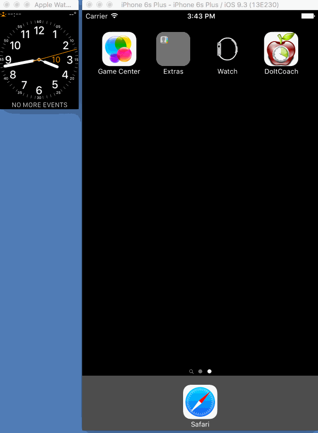

DoItCoach
=========
DoItCoach is a demo app to build an Watch app step by steps. You can find the tutorials on my blog (coming soon).

## What is the app doing?
Have you ever wonder how to get things done efficiently during the day?

With DoItCoach, plan your day with some tasks, plan for some healthy breaks in beetween to keep your brain active.  

## Pre-requisites
* iOS9.2
* watchOS2
* iPhone/Watch 

## Build it
```
open DoItCoach.xcodeproj
```
## Run it

Et voila!

## Tutorials
[Watch tutorial 1: Which app?](http://corinnekrych.blogspot.fr/2016/04/watch-tutorial-1-which-app.html)
[Watch tutorial 2: Watch Architecture](http://corinnekrych.blogspot.fr/2016/04/watch-tutorial-2-watch-architecture.html)
[Watch tutorial 3: Layout](http://corinnekrych.blogspot.fr/2016/04/watch-tutorial-3-layout.html)
[Watch tutorial 4: Animation](http://corinnekrych.blogspot.fr/2016/04/watch-tutorial-4-animation.html)
[Watch tutorial 5: Watch Connectivity - Direct Message](http://corinnekrych.blogspot.fr/2016/04/watch-tutorial-5-watch-connectivity.html)
[Watch tutorial 6: Watch Connectivity - Application Context](http://corinnekrych.blogspot.fr/2016/04/watch-tutorial-6-watch-connectivity.html)
       https://github.com/corinnekrych/DoItCoach
